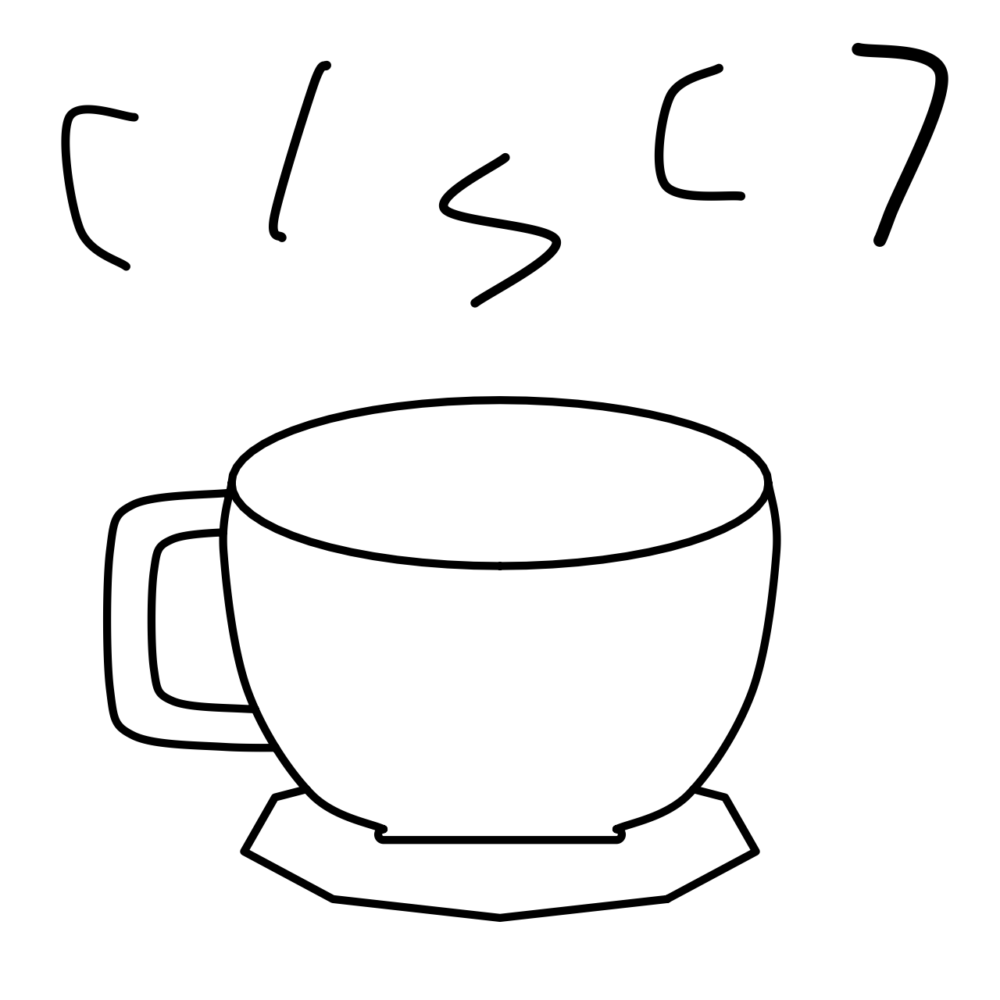

\pagebreak

## Hello, world! <!-- markdownlint-disable-line MD026 -->

- 본 문서는 Contributor로 인정되거나 Issue(Conversation 포함)를 제출한 오픈 소스 활동(기여)만 다룹니다. 그 밖의 내용을 다루는 자료의 목록은 [더보기](#더보기) 절에서 보실 수 있습니다.
  - GitHub 또는 GitLab의 공개 저장소여야 합니다.
  - 중요도와 관계없이, 첫 기여가 오래된 것부터 빠짐없이 기재합니다.
    - 나중에 더 기여했더라도 같은 저장소는 한 번만 기재합니다.
    - Pull Request의 비교 저장소로 사용하기 위한 Fork로서 Pull Request가 Close되면 삭제할 저장소는 기재하지 않아도 됩니다.
  - 직접 소유한 개인 저장소가 아니라면 기여의 종류를 표시합니다.
  - 예외적으로, 오픈 소스 커뮤니티에 회원 가입하는 것과 같은 milestone을 다룰 수 있습니다.
- 본 문서는 [Pandoc’s Markdown](https://pandoc.org/chunkedhtml-demo/8-pandocs-markdown.html)으로 작성되며 [markdownlint](https://github.com/DavidAnson/markdownlint)를 준수합니다. 정확한 결과를 확인하려면 [Pandoc](https://pandoc.org/)으로 [LaTeX](https://www.latex-project.org/)를 사용하여 빌드해야 합니다. 본 문서의 최신 버전 소스 코드는 [이 GitHub 링크](https://github.com/MCPE-PC/MCPE-PC/blob/main/PORTFOLIO-OSS-KO.md)에서 확인할 수 있습니다.
- 본 문서의 공개 최신 버전은 [이 링크](https://github-profile-artifact.mcpepc.com/PORTFOLIO-OSS-KO.pdf)에서 다운로드할 수 있습니다.
- 시간대는 달리 표기하지 않은 한 한국 표준시(Asia/Seoul, UTC+9)입니다.
- 본 문서는 [CC BY 4.0](https://github.com/MCPE-PC/MCPE-PC/blob/main/LICENSE)으로 이용 허락됩니다.
- 본 문서는 [Semantic Versioning](https://semver.org/)을 따릅니다.

\pagebreak

## 2014년

### Scratch 회원 가입

- 9월 17일에 [Scratch](https://scratch.mit.edu/)에 처음 회원 가입하였습니다.
- [parkjh0528](https://scratch.mit.edu/users/parkjh0528/)

## 2016년

### GitHub 회원 가입

- 7월 13일에 [GitHub](https://github.com/)에 처음 회원 가입하였습니다.
- [@MCPE-PC](https://github.com/MCPE-PC)

### Thingiverse 회원 가입

- 7월 13일에 [Thingiverse](https://www.thingiverse.com/)에 처음 회원 가입하였습니다.
- [MCPE_PC](https://www.thingiverse.com/mcpe_pc/)

\pagebreak

## 2017년

### [MCPE-PC/previously-MCPE-PC.github.io](https://github.com/MCPE-PC/previously-MCPE-PC.github.io): 첫 저장소

- GitHub에서 가입을 제외한 첫 활동입니다.
- 2월 11일에 이 저장소를 생성하였습니다.
- [Cayman 테마](https://github.com/pages-themes/cayman)를 기반으로 연습 성격의 [GitHub Pages](https://pages.github.com/)를 구성하였습니다.
- 지금은 서비스가 종료된 issue.sh를 이용하였습니다.

### [Astro36/pugfolio](https://github.com/Astro36/pugfolio): 첫 Issue, 첫 Pull Request

- 9월 17일에 [`#2 편의성 문제 1개+오류 2개`](https://github.com/Astro36/pugfolio/issues/2)를 제출하였습니다.
  - 첫 Issue입니다.
- 12월 2일에 [`#3 별 거 없는 것`](https://github.com/Astro36/pugfolio/pull/3)을 제출하였습니다.
  - 첫 Pull Request입니다. 코드 스타일을 무시하는 등 미숙했지만 최종적으로 Merge되었습니다.

### [DarkTornado/darkCheater](https://github.com/DarkTornado/darkCheater): Issue

- 12월 10일에 [`#2 각종 오류가 많습니다 (...)`](https://github.com/DarkTornado/darkCheater/issues/2)를 제출하였습니다.
- 별도 연락을 통해 종결하였습니다.

\pagebreak

## 2018년

### [WIP] [MCPE-PC/blog](https://github.com/MCPE-PC/blog)

- GitHub Pages에서 동작하는 블로그를 구축하고 앞으로 글을 작성하고자 했습니다.
- 1월 6일에 저장소를 생성하였지만 지금까지 건드리지 않았습니다.
- 지금은 서비스가 종료된 issue.sh를 이용하였습니다.

### [organization/RankManager](https://github.com/organization/RankManager): Issue

- 1월 12일에 [`#4 API 3.0.0-ALPHA10`](https://github.com/organization/RankManager/issues/4)을 제출하였고 곧 종결되었습니다.

### [onebone/TriggerPE](https://github.com/onebone/TriggerPE): Issue

- 1월 16일에 [`#1 설명좀...`](https://github.com/onebone/TriggerPE/issues/1)을 제출하였고 아직 완성되지 않은 프로젝트라는 답변을 받았습니다.

### [SOLOPlugins-PocketMine/SPortal](https://github.com/SOLOPlugins-PocketMine/SPortal): Pull Request

- 2월 10일에 [`#4 Bump API version`](https://github.com/SOLOPlugins-PocketMine/SPortal/pull/4)를 제출하였고 Merge되었습니다.

### [MCPE-PC/MineSponge](https://github.com/MCPE-PC/MineSponge): Fork

- 단순하고 인기 있지만 업데이트가 중단되어 더이상 작동하지 않는 [MCFT-Server/MineSponge](https://github.com/MCFT-Server/MineSponge)를 2월 10일에 Fork하여 대응하였습니다.
- [여기](https://poggit.pmmp.io/ci/MCPE-PC/MineSponge/~) Poggit에서 빌드됩니다.
- 지금은 서비스가 종료된 issue.sh를 이용하였습니다.

### [presentkim-pm/DustBin](https://github.com/presentkim-pm/DustBin): Issue

- 2월 11일에 [`#1 Permission이 틀린 것 같은데요`](https://github.com/presentkim-pm/DustBin/issues/1)를 제출하여 잘못된 문서 내용을 지적하였습니다.

### [MCPE-PC/OreAboveEndStone](https://github.com/MCPE-PC/OreAboveEndStone)

- [MCFT-Server/MineSponge](https://github.com/MCFT-Server/MineSponge)로부터 영감을 받아 2월 11일에 저장소를 생성하였습니다.
- [여기](https://poggit.pmmp.io/ci/MCPE-PC/OreAboveEndStone/~) Poggit에서 빌드됩니다.
- 지금은 서비스가 종료된 issue.sh를 이용하였습니다.

### [MCPE-PC/ItemFrameProtector](https://github.com/MCPE-PC/ItemFrameProtector)

- 3월 6일에 저장소를 생성하였습니다.
- 매우 단순하지만 강력한 [아이템 액자](https://minecraft.fandom.com/wiki/Item_Frame) 아이템 보호 기능을 제공합니다.
- [여기](https://poggit.pmmp.io/ci/MCPE-PC/ItemFrameProtector/~) Poggit에서 빌드됩니다.
- 지금은 서비스가 종료된 issue.sh를 이용하였습니다.

### [RikkaApps/Shizuku](https://github.com/RikkaApps/Shizuku): Issue

- Android 루팅에 관심이 생겼습니다.
- 5월 3일에 [`#20 Support system plugin mode`](https://github.com/RikkaApps/Shizuku/issues/20)를 제출하였고 여러 사용자가 동의하였지만 수용되지 않았습니다.
- 시간이 지나며 저장소가 크게 성장하였습니다.

### [switchbrew/nx-hbmenu](https://github.com/switchbrew/nx-hbmenu): Pull Request

- 6월 3일에 [`#43 :unicorn: Improve & add Korean language`](https://github.com/switchbrew/nx-hbmenu/pull/43)를 제출하여 Merge되었습니다.

### [tebexio/BuycraftPM](https://github.com/tebexio/BuycraftPM): Pull Request

- 9월 3일에 [`#35 build-plugin.sh should be excluded when building`](https://github.com/tebexio/BuycraftPM/pull/35)을 제출하여 Merge되었습니다.

### [MCPE-PC/MiBand3KoreanTools](https://github.com/MCPE-PC/MiBand3KoreanTools)

- 샤오미 사용자 커뮤니티 의견을 바탕으로 직접 사용하기 위해 만들었습니다.
- 9월 19일에 저장소를 생성하였습니다.
- 샤오미 미 밴드3 한국어 펌웨어를 사용하기 위한 Mi Fit를 생성할 수 있습니다.
- 모든 코드가 Bash 스크립트로 작성되었습니다.

### [MCPE-PC/soundpad.js](https://github.com/MCPE-PC/soundpad.js)

- 가상 마이크 드라이버에 관심이 생겼습니다.
- 11월 17일에 저장소를 생성하였습니다.
- [Soundpad](https://www.leppsoft.com/soundpad/en/)의 [Remote Control](https://www.leppsoft.com/soundpad/help/manual/tutorial/rc/)을 제공하는 Node.js wrapper입니다.
- Windows에서 [명명된 파이프](https://learn.microsoft.com/ko-kr/windows/win32/ipc/named-pipes)를 사용합니다.
- 지금은 서비스가 종료된 Greenkeeper와 issue.sh를 이용하였습니다.
- 더이상 Maintain하지 않습니다. [Seblor/soundpad.js](https://github.com/Seblor/soundpad.js)를 대신 사용하는 것이 낫습니다.

### [js-org/js.org](https://github.com/js-org/js.org): Pull Request

- [MCPE-PC/soundpad.js](https://github.com/MCPE-PC/soundpad.js)만을 위한 아름다운 도메인 이름을 제공받고 싶었습니다.
- 11월 25일에 [`#2549 soundpad.js.org`](https://github.com/js-org/js.org/pull/2549)을 제출하여 Merge되었습니다.

### [alexsolur/MiBandageLang](https://github.com/alexsolur/MiBandageLang): Outside Collaborator

- 한국어 번역가로 참여하였습니다.
- 12월 23일에 [`41df3d2`](https://github.com/alexsolur/MiBandageLang/commit/41df3d23072609ded00b253ffb519f59513ceb57)를 커밋하였습니다.

\pagebreak

## 2019년

### [WIP] [JaehyeonIT/Koala](https://github.com/JaehyeonIT/Koala): Owner

- 공동인증서(구 공인인증서) 가입자 소프트웨어를 오픈 소스로 개방하기 위해 1월 3일에 저장소를 생성하였습니다.
- 여러가지 방법으로 구현해보았지만 아직 출시되지 않았습니다.
- 제 공동인증서 패키지 중 풀패키지 GUI를 담당합니다.
- 지금은 서비스가 종료된 issue.sh를 이용하였습니다.

### [ko-KR/JOIN](https://github.com/ko-KR/JOIN): Owner

- 누구나 [ko-KR organization](https://github.com/ko-KR)에 Member로 참여할 수 있도록 1월 9일에 저장소를 생성하였습니다.
- 곧 API를 이용해 자동으로 초대하도록 변경됩니다.

### [MCPE-PC/nReQuest](https://github.com/MCPE-PC/nReQuest)

- 유상 제작 요청에 따라 1월 20일에 비공개 저장소를 생성하였습니다.
- 시간이 지나 공개 저장소가 되었습니다.
- [여기](https://poggit.pmmp.io/ci/MCPE-PC/nReQuest/~) Poggit에서 빌드되고 [Virion](https://github.com/poggit/support/blob/master/virion.md)을 사용합니다.

### [forwardemail/free-email-forwarding](https://github.com/forwardemail/free-email-forwarding): Issue

- [Forward Email](https://forwardemail.net/)을 직접 이용하고자 하였습니다.
- 1월 26일에 [`#90 How to send a mail with Nodemailer`](https://github.com/forwardemail/free-email-forwarding/issues/90)를 제출하였습니다.
- 이메일 프로세스에 대한 이해가 부족했었습니다.

### [inxomnyaa/MagicWE](https://github.com/inxomnyaa/MagicWE): Issue

- 사용 중 일반적이지 않지만 처리되어야 하는 오류 상황을 발견하였습니다.
- 1월 27일에 [`#117 Error when executing command in console`](https://github.com/inxomnyaa/MagicWE/issues/117)을 제출하였습니다.

### [minecraft-linux/mcpelauncher-manifest](https://github.com/minecraft-linux/mcpelauncher-manifest): Issue

- [GNOME](https://www.gnome.org/) 환경에서 오류가 발생하여 2월 5일에 [`#53 Could not select custom skin`](https://github.com/minecraft-linux/mcpelauncher-manifest/issues/53)을 제출하였습니다.
- 여러 사용자가 같은 증상을 겪었습니다.
- 7월 24일에는 [`#123 IME support`](https://github.com/minecraft-linux/mcpelauncher-manifest/issues/123)를 제출하였습니다.

### [MCPE-PC/PocketMusic](https://github.com/MCPE-PC/PocketMusic)

- 4월 2일에 비공개 저장소를 생성하였습니다.
- [Minecraft가 애드온을 공식 지원](https://www.minecraft.net/en-us/article/introducing-add-ons)하게 되어 기존 게임 음악을 수정하지 않고 음악을 추가할 수 있다는 것을 처음 분석하였습니다.
- 처음부터 [GPL-3.0 라이선스](https://github.com/MCPE-PC/PocketMusic/blob/main/LICENSE)를 적용하였지만 유료 판매하였습니다.
- 인터넷 커뮤니티에서 성공적인 판매를 이루어냈고 높은 만족도를 평가받았습니다.
- 시간이 지나 공개 저장소가 되었습니다.

### [pythonkr/pyconkr-2019-web](https://github.com/pythonkr/pyconkr-2019-web): Issue

- 6월 3일에 [`#140 티켓 구매 자동화 방지`](https://github.com/pythonkr/pyconkr-2019-web/issues/140)를 제출하였습니다.

### GitLab 회원 가입

- 7월 30일에 [GitLab](https://github.com/)에 처음 회원 가입하였습니다.
- [@MCPE_PC](https://gitlab.com/MCPE_PC)

### [MCPE-PC/spoqa-pycon-2019-code-challenge](https://github.com/MCPE-PC/spoqa-pycon-2019-code-challenge): Fork

- [파이콘 한국 2019](https://2019.pycon.kr/)에서 [스포카](https://spoqa.co.kr/)가 진행한 행사에 참여하였습니다.
- 8월 18일에 [spoqa/spoqa-pycon-2019-code-challenge](https://github.com/spoqa/spoqa-pycon-2019-code-challenge)를 Fork하여 참여하였습니다.

### [organization/RapidPM](ps://github.com/organization/RapidPM): Pull Request

- 8월 26일에 [`#2 간단한 수정`](https://github.com/organization/RapidPM/pull/2)을 제출하여 Merge되었습니다.

### [WIP] [MCPE-PC/MCPE-PC.github.io](https://github.com/MCPE-PC/MCPE-PC.github.io)

- [MCPE-PC/previously-MCPE-PC.github.io](https://github.com/MCPE-PC/previously-MCPE-PC.github.io)를 대체할 [GitHub Pages 사용자 사이트](https://docs.github.com/en/pages/getting-started-with-github-pages/about-github-pages#types-of-github-pages-sites)로 9월 29일에 저장소를 생성하였습니다.
- 지금까지 사용할 만한 일이 없어 내용이 없습니다.

### [pmmp/PocketMine-MP](https://github.com/pmmp/PocketMine-MP)

- 10월 7일에 [`#3141 Provide a way to bypass accepted skin sizes`](https://github.com/pmmp/PocketMine-MP/issues/3141)를 제출하였고 여러 사용자로부터 반대 의견을 받았습니다.

### [MCPE-PC/MapImageEngine](https://github.com/MCPE-PC/MapImageEngine): Fork

- [FaigerSYS/MapImageEngine](https://github.com/FaigerSYS/MapImageEngine)를 사용하고 싶지만 활발하게 업데이트되지 않고 더이상 작동하지 않아 기본적인 업데이트를 하기 위해 11월 3일에 Fork하였습니다.

### [WIP] [MCPE-PC/cultureland-payment](https://github.com/MCPE-PC/cultureland-payment)

- 인터넷 커뮤니티에서 어떤 오픈 소스 소프트웨어를 개발할 지 진행한 투표에서 선정되어 11월 24일에 저장소를 생성하였습니다.
- 컬쳐랜드상품권으로 [컬쳐랜드](https://www.cultureland.co.kr/) 컬쳐캐쉬를 충전하는 과정을 브라우저 자동화를 이용해 인터페이스화합니다.
- 실제로는 법적 위험 등으로 인해 오픈 소스 공개하지 않았습니다.

\pagebreak

## 2020년

### [bridge-core/bridge.](https://github.com/bridge-core/bridge.): Conversation

- 4월 14일에 [`#172 [Feature] Please upload snap to Snap Store`](https://github.com/bridge-core/bridge./discussions/172)를 제출하였습니다.

### [MCPE-PC/PocketMusic-addon-SimpleArea](https://github.com/MCPE-PC/PocketMusic-addon-SimpleArea)

- [MCPE-PC/PocketMusic](https://github.com/MCPE-PC/PocketMusic)에 [organization/SimpleArea](https://github.com/organization/SimpleArea) 연동 기능을 선택적으로 제공하기 위해 10월 2일에 저장소를 생성하였습니다.
- [여기](https://poggit.pmmp.io/ci/MCPE-PC/PocketMusic-addon-SimpleArea/~) Poggit에서 빌드됩니다.

### [MCPE-PC/MinecraftKillToSteal](https://github.com/MCPE-PC/MinecraftKillToSteal)

- 유상 제작 요청에 따라 11월 2일에 비공개 저장소를 생성하였습니다.
- 시간이 지나 공개 저장소가 되었습니다.
- [여기](https://poggit.pmmp.io/ci/MCPE-PC/MinecraftKillToSteal/~) Poggit에서 빌드되고 [Virion](https://github.com/poggit/support/blob/master/virion.md)을 사용합니다.

### [MCPE-PC/MCPE-PC](https://github.com/MCPE-PC/MCPE-PC)

- [프로필 README](https://docs.github.com/en/account-and-profile/setting-up-and-managing-your-github-profile/customizing-your-profile/managing-your-profile-readme) 규칙을 충족하기 위해 12월 28일에 저장소를 생성하였습니다.
- 프로필 README와 본 문서 등 오픈 소스 문서를 제공합니다.
- 빌드 결과물은 [GitHub Pages](https://pages.github.com/)로 [github-profile-artifact.mcpepc.com](https://github-profile-artifact.mcpepc.com/)에 호스팅됩니다.

\pagebreak

## 2021년

### [PreMiD/Extension](https://github.com/PreMiD/Extension): Issue

- 1월 10일에 [`#97 Extension displays translate strings which should instead be CJK languages`](https://github.com/PreMiD/Extension/issues/97)를 제출하였습니다.

### [MCPE-PC/accredited-certificate](https://github.com/MCPE-PC/accredited-certificate)

- 4월 5일에 저장소를 생성하였습니다.
- npm에 [accredited-certificate 패키지](https://www.npmjs.com/package/accredited-certificate)로 게시되어 있습니다.
- 제 공동인증서 패키지 중 파일 형태 공동인증서를 처리하는 API를 담당했습니다.
- 이제 모든 매체의 공동인증서 처리 전체에 대한 API를 담당합니다. 이 재작성 버전은 아직 공개하지 않았습니다.

### [Melvin-Abraham/Google-Assistant-Unofficial-Desktop-Client](https://github.com/Melvin-Abraham/Google-Assistant-Unofficial-Desktop-Client): Pull Request

- 5월 25일에 [`#395 Update ko-KR strings`](https://github.com/Melvin-Abraham/Google-Assistant-Unofficial-Desktop-Client/pull/395)를 제출하여 Merge되었습니다.

### [WIP] [MCPE-PC/sponsor.mcpepc.me](https://github.com/MCPE-PC/sponsor.mcpepc.me)

- 커뮤니티로부터 오픈 소스 활동에 대한 재정 지원을 받을 홈페이지를 제작하기 위해 6월 10일에 저장소를 생성하였습니다.
- 규제 등으로 실제 제작하지 않았지만 이제 해당 문제는 해결되었기 때문에 제작할 예정입니다.

### [redis/node-redis](https://github.com/redis/node-redis): Issue

- v4 개발 버전의 치명적인 숨은 버그를 해결하기 위해 7월 17일에 [`#1628 v4: Should send bytes instead of UTF-16 length`](https://github.com/redis/node-redis/issues/1628)를 제출하였습니다.

### [MCPE-PC/list-accredited-certificates](https://github.com/MCPE-PC/list-accredited-certificates)

- 11월 2일에 저장소를 생성하였습니다.
- 제 공동인증서 패키지 중 파일 드라이브에 있는 공동인증서의 목록을 조회하는 API를 담당했습니다.
- [MCPE-PC/accredited-certificate](https://github.com/MCPE-PC/accredited-certificate)로 통합되었습니다.

### [MCPE-PC/mcpepc.com](https://github.com/MCPE-PC/mcpepc.com)

- 원래 가지고 있던 도메인 이름에 대한 홈페이지를 제작하기 위해 12월 4일에 저장소를 생성하였습니다.
- SvelteKit을 이용하며, 같은 기반으로 재작성할 예정입니다.

### [ko-KR/.github](https://github.com/ko-KR/.github): Owner

- 커뮤니티 기여로 생성된 저장소에 12월 23일에 [e15a832](https://github.com/ko-KR/.github/commit/e15a83236d4aff657c71dfdccee7a272aa1d5585)를 커밋하였습니다.

### [JaehyeonIT/.github](https://github.com/JaehyeonIT/.github): Owner

- 회사의 GitHub 프로필을 맞춤화하기 위해 12월 30일에 저장소를 생성하였습니다.

\pagebreak

## 2022년

2022년에는 새로운 오픈 소스 활동을 하지 않았거나 활동한 저장소가 모두 오픈 소스 커뮤니티에서 삭제되었습니다.

\pagebreak

## 2023년

2023년에는 새로운 오픈 소스 활동을 하지 않았거나 활동한 저장소가 모두 오픈 소스 커뮤니티에서 삭제되었습니다.

\pagebreak

## 2024년

### [MCPE-PC/skills-hello-github-actions](https://github.com/MCPE-PC/skills-hello-github-actions), [MCPE-PC/skills-test-with-actions](https://github.com/MCPE-PC/skills-test-with-actions), [MCPE-PC/skills-publish-packages](https://github.com/MCPE-PC/skills-publish-packages), [MCPE-PC/skills-write-javascript-actions](https://github.com/MCPE-PC/skills-write-javascript-actions), [MCPE-PC/skills-deploy-to-azure](https://github.com/MCPE-PC/skills-deploy-to-azure)

- 3월 14일에 [Microsoft Learn의 GitHub Actions 컬렉션](https://learn.microsoft.com/en-us/collections/n5p4a5z7keznp5)을 학습하던 중 저장소를 생성하였습니다.
- 오픈 소스로 남겨두었습니다.

### [MCPE-PC/2024-dimigo-1person-1project](https://github.com/MCPE-PC/2024-dimigo-1person-1project)

- `공업 일반` 과목 수행평가(1인1Project) 자료를 오픈 소스로 기록하기 위해 3월 22일에 저장소를 생성하였습니다.

### [MCPE-PC/2024-dimigo-class-big-data-analysis](https://github.com/MCPE-PC/2024-dimigo-class-big-data-analysis)

- `빅데이터 분석` 과목 실습 내용을 오픈 소스로 기록하기 위해 4월 4일에 저장소를 생성하였습니다.

### [MCPE-PC/responsible-backup](https://github.com/MCPE-PC/responsible-backup)

- 4월 19일에 저장소를 생성하였습니다.
- 자동화 스케줄러와 함께 사용하기 좋은 실용적인 데이터 백업 소프트웨어를 설계하고 있습니다.

### ORCID 회원 가입

- 4월 22일에 [ORCID](https://orcid.org/)에 처음 회원 가입하였습니다.
- [0009-0006-3278-0429](https://orcid.org/0009-0006-3278-0429)

### [sindresorhus/Actions](https://github.com/sindresorhus/Actions): Issue

- 몇 주 전 macOS 커뮤니티에 진입하게 되고 Mac다운(Macish) 사용자 환경을 구성하고 싶었습니다.
- 단축어(Shortcuts) 앱에서 임시 디렉토리 생성 동작(action)이 있기를 원하여 4월 23일에 [`#242 Action proposal: Create a temporary directory`](https://github.com/sindresorhus/Actions/issues/242)를 제출하였습니다.

### [hackclub/dinosaurs](https://github.com/hackclub/dinosaurs): Member, Pull Request

- [Draw Dino](https://hack.af/draw-dino)에 기여하기 위해 6월 18일에 공룡을 그리고 [#1002 Add MCPE_PC_Jaehyeon_Dino](https://github.com/hackclub/dinosaurs/pull/1002)를 제출하여 Merge되었습니다.

### [MCPE-PC/2024-dimigo-class-app-development](https://github.com/MCPE-PC/2024-dimigo-class-app-development)

.pdf>)

- [GitHub Classroom](https://classroom.github.com/) 저장소에 관리하던 `응용 프로그래밍 개발` 과목 실습 내용을 오픈 소스로 기록하기 위해 6월 19일에 저장소를 생성하였습니다.
- [git-filter-repo](https://github.com/newren/git-filter-repo)를 이용해 이미 Git에 stage된 비공개 정보를 모두 제거했습니다.
- 특별히 [`Signed-off-by`](https://git-scm.com/docs/git-commit#Documentation/git-commit.txt---signoff)를 추가하고 rebase했습니다.

### [hackclub/blot](https://github.com/hackclub/blot): Member, Pull Request

- [Arcade](https://hack.af/arcade) 활동으로 예술 생성 프로그램을 작성하고 [Blot](https://blot.hackclub.com/)에 기여하기 위해 6월 18일에 [#548 Ateacup-MCPEPC](https://github.com/hackclub/blot/pull/548)를 제출하여 Merge되었습니다.
- 실행할 때마다 다른 랜덤 컵을 그립니다.
- [Scrapbook](https://scrapbook.hackclub.com/JaehyeonPark)에 기록하였습니다.
- [이 Blot 링크](https://blot.hackclub.com/editor?src=https://raw.githubusercontent.com/hackclub/blot/main/art/Ateacup-MCPEPC/index.js)에서 코드를 실행해볼 수 있습니다.
- Blot의 배송이 수 개월 지연되고 있습니다.

### [MCPE-PC/dino.icu](https://github.com/MCPE-PC/dino.icu)

- [가장 멋진 공룡](https://github.com/hackclub/dinosaurs/blob/main/MCPE_PC_Jaehyeon_Dino.png)을 가장 멋지게 자랑하기 위해 6월 27일에 저장소를 생성하고 웹사이트를 제작했습니다.
- [Programming Quotes API](https://programming-quotesapi.vercel.app/)의 인용구를 인용합니다.
- 페이지 어디든 [개인 홈페이지](https://www.mcpepc.com)로 링크됩니다.

### [hackclub/dns](https://github.com/hackclub/dns): Member, Pull Request

- [Arcade](https://hack.af/arcade) 활동으로 [MCPE-PC/dino.icu](https://github.com/MCPE-PC/dino.icu)에 그와 잘 어울리는 [pc.dino.icu](https://pc.dino.icu/) 도메인 이름을 설정하고 싶었습니다.
- 7월 3일에 [#1208 Adding pc.dino.icu](https://github.com/hackclub/dns/pull/1208)를 제출하였습니다.
- [Scrapbook](https://scrapbook.hackclub.com/JaehyeonPark)에 기록하였습니다.

### OSHWLab 회원 가입

- 7월 6일에 [OSHWLab](https://oshwlab.com/)에 처음 회원 가입하였습니다.
- [mcpe_pc](https://oshwlab.com/mcpe_pc)

### [MCPE-PC/2023-dimigo-class-app-design](https://github.com/MCPE-PC/2023-dimigo-class-app-design)

- `응용 프로그래밍 화면 구현` 과목 실습 내용을 오픈 소스로 기록하기 위해 7월 8일에 저장소를 생성하였습니다.

### [MCPE-PC/2022-dimigo-life-five-cuts](https://github.com/MCPE-PC/2022-dimigo-life-five-cuts)

- 이전에 한 `사물 인터넷 서비스 기획` 과목 2명 팀 프로젝트(인생 다섯컷)를 오픈 소스로 공개하기 위해 7월 9일에 저장소를 생성하였습니다.
- 2022년 11월 11일에 보고서를 완성하였습니다.
- 팀원을 `Co-author`로 입력했습니다.

### [MCPE-PC/2022-dimigo-chaomin-wake-up](https://github.com/MCPE-PC/2022-dimigo-chaomin-wake-up)

- 이전에 한 `사물 인터넷 서비스 기획` 과목 개인 프로젝트(일어나, 잼민아!)를 오픈 소스로 공개하기 위해 7월 12일에 저장소를 생성하였습니다.
- 2022년 7월 1일에 보고서를 완성하였습니다.
- 동영상 파일 크기를 20MB 이하로 압축하기 위해 특별히 인코딩했습니다. 압축 후 크기는 19MB입니다.

### [is-a-dev/register](https://github.com/is-a-dev/register): Issue, Pull Request

- 새롭고 간결한 [pc.is-a.dev](https://pc.is-a.dev/) 도메인에 사용하려 한 [ForwardDomain.net](https://forwarddomain.net/) 호환성을 요청하기 위해 7월 17일에 [`#14952 [Feedback/suggestion] add _ to extraSupportedNames`](https://github.com/is-a-dev/register/issues/14952)을 제출하였습니다.
- 대체 서비스를 추천받고 Close되었습니다.
- [redirect.pizza](https://redirect.pizza/)를 사용한 DNS 구성을 배포하기 위해 7월 19일에 [`#14985 Register pc.is-a.dev`](https://github.com/is-a-dev/register/pull/14985)을 제출하여 Merge되었습니다.

### [RsaCtfTool/RsaCtfTool](https://github.com/RsaCtfTool/RsaCtfTool)

- 최신 버전에서 빌드가 불가능한 문제를 해결하고 비효율적인 빌드를 개선하기 위해 7월 29일에 [`#485 Bump gmpy2 version and use python docker base image`](https://github.com/RsaCtfTool/RsaCtfTool/pull/485)을 제출하여 정말 빠르게 Merge되었습니다.

### [MCPE-PC/freecodecamp-stock-price-checker](https://github.com/MCPE-PC/freecodecamp-stock-price-checker): Fork

- [Stock Price Checker Information Security Project](https://www.freecodecamp.org/learn/information-security/information-security-projects/stock-price-checker)를 수행하기 위해 7월 29일에 [freeCodeCamp/boilerplate-project-stockchecker](https://github.com/freeCodeCamp/boilerplate-project-stockchecker)를 Fork하였습니다.

### [MCPE-PC/kr-software-engineer](https://github.com/MCPE-PC/kr-software-engineer)

- 본 모듈을 통해 [소프트웨어기술자 경력관리시스템](https://career.sw.or.kr/)의 사용을 프로그램화할 수 있게 함으로써 별도 정보시스템과 연계하여 경력 데이터베이스를 자동으로 업데이트&middot;경력 항목별 부가 설명 내용을 작성&middot;필요한 형태의 Markdown 문서(&lt;소프트웨어기술자 경력 설명서&gt;) 생성 자동화&middot;구술로 부가 설명할 필요 최소화&middot;언제든지 &lt;소프트웨어기술자 경력증명서&gt;를 소지함을 스스로 인증하면 해당 버전의 증명서에 대한 설명서와 최신 버전의 증명서와 최신 버전의 문서를 자유롭게 열람하고 다운로드하는 기능 제공&middot;더욱 편리한 삶을 영위하도록 하기 위해 8월 17일에 저장소를 생성하였습니다.

\pagebreak

## 더보기

- 공적 증빙 가능한 소프트웨어 분야 이력은 &lt;소프트웨어기술자 경력증명서&gt;^[해당 파일은 사용 목적을 기재하여 요청해주시면 보내드리겠습니다.]와 &lt;소프트웨어기술자 경력 설명서&gt;^[해당 파일은 사용 목적을 기재하여 요청해주시면 보내드리겠습니다. 조만간 증명서 소지 시 갱신 및 설명서 다운로드를 자동화하겠습니다.]를 확인해주세요.
- 소프트웨어를 포함한 전체 분야 이력과 개인 프로젝트, 봉사활동 등에 관한 전반적 사항은 LinkedIn([`in/jaehyeon`](https://www.linkedin.com/in/jaehyeon/))을 확인해주세요. 다만, 전체 공개되지 않는 소프트웨어 분야 기술경력은 위 &lt;소프트웨어기술자 경력증명서&gt;에 있습니다.
- 최신 일상생활은 Instagram([`@mcpe_pc_`](https://www.instagram.com/mcpe_pc_/))을 확인해주세요.
- 공개된 신상과 실시간 디스코드 상태, 추가적인 안내 사항은 [GitHub 프로필 README](https://github.com/MCPE-PC/MCPE-PC/blob/main/README.md) 내용을 확인해주세요. (HTML과 PDF로도 제공된답니다!)

\pagebreak

## 버전 기록

### 1.0.0 (2024-06-22)

- 최초 버전

### 1.1.0 (2024-07-12)

- 누락된 내용 추가 및 업데이트
- `pdf-engine` 변경
- 기본 글꼴 변경

### 1.1.1 (2024-07-16)

- 링크 색 제거 및 서식 개선
- 빌드 및 다운로드 방법 변경
- 내용 업데이트

### 1.1.2 (2024-07-16)

- 이미지 파일 경로 변경
- 내용 업데이트

### 1.2.0 (2024-08-28)

- 안내문 일부 수정
- 내용 업데이트
